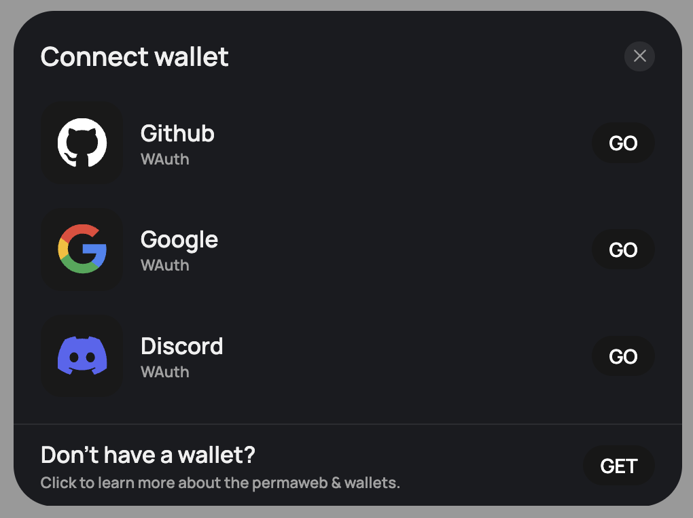

# WAuth 

Seamless Social auth for Arweave Ecosystem

Check [demo](./demo/) directory for a Vite + React example implementation of [@wauth/strategy](https://www.npmjs.com/package/@wauth/strategy) with [Arweave Wallet Kit](https://www.npmjs.com/package/@arweave-wallet-kit/react)

WAuth can be implemented through